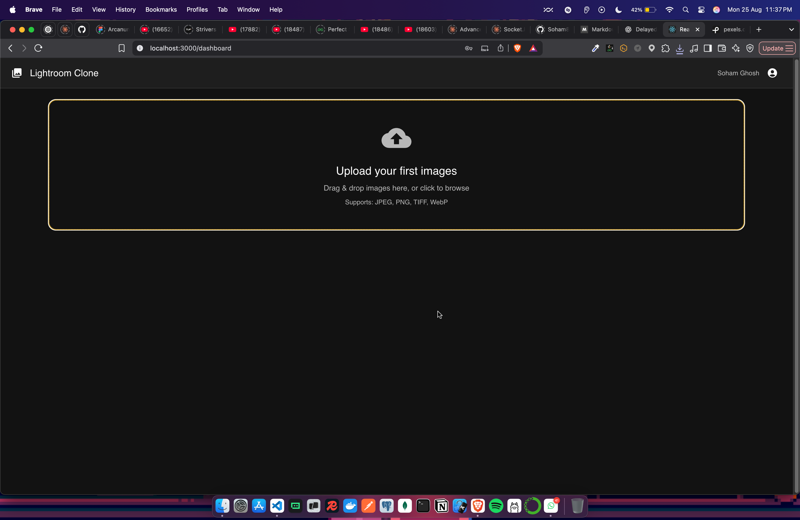
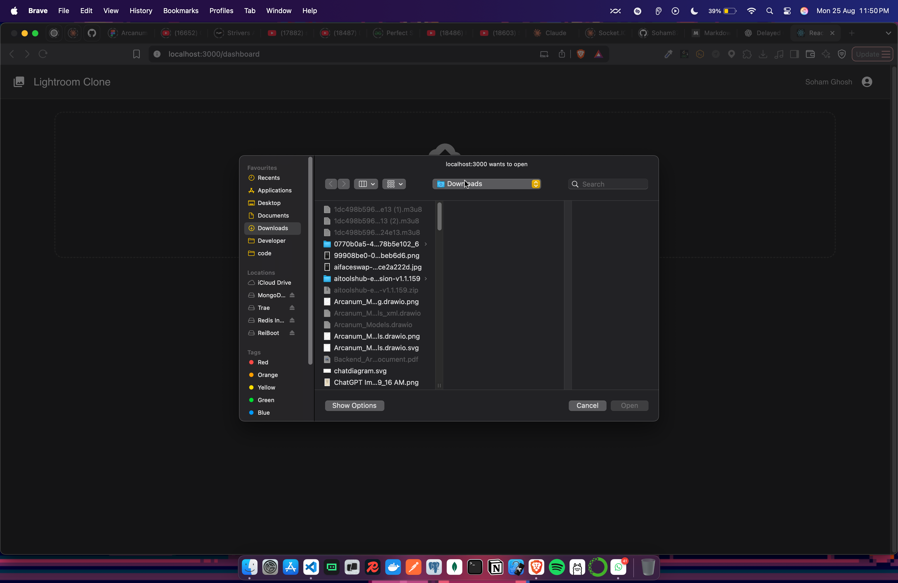
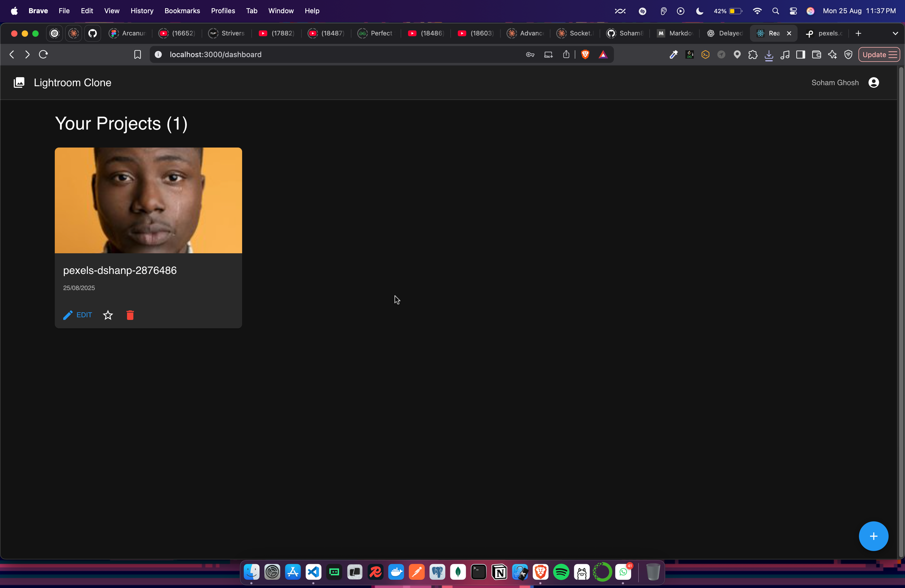
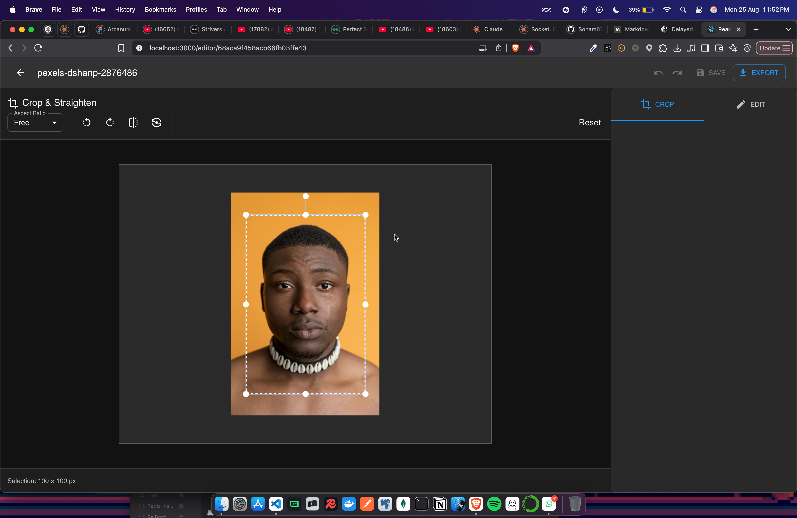
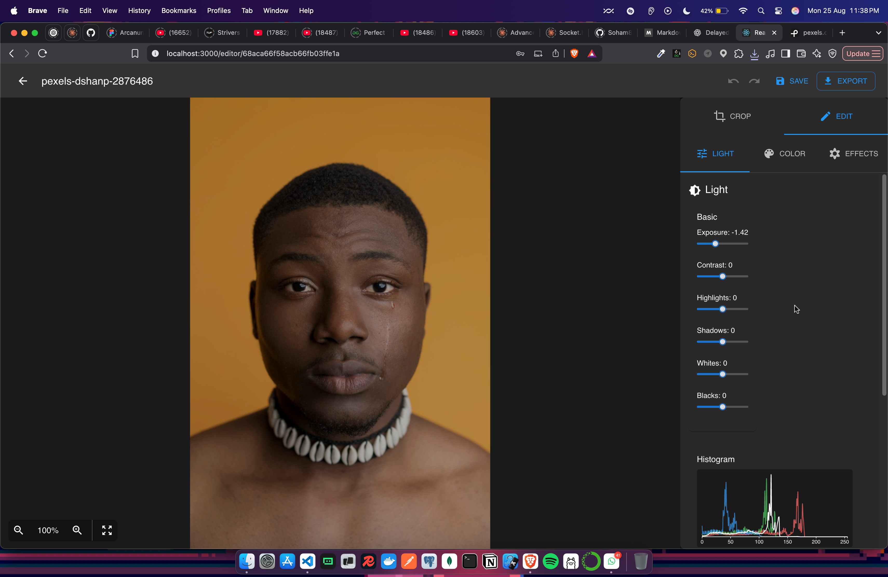
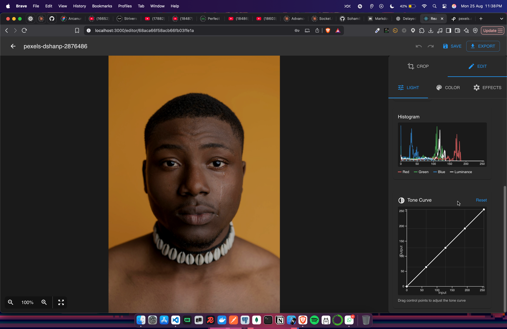
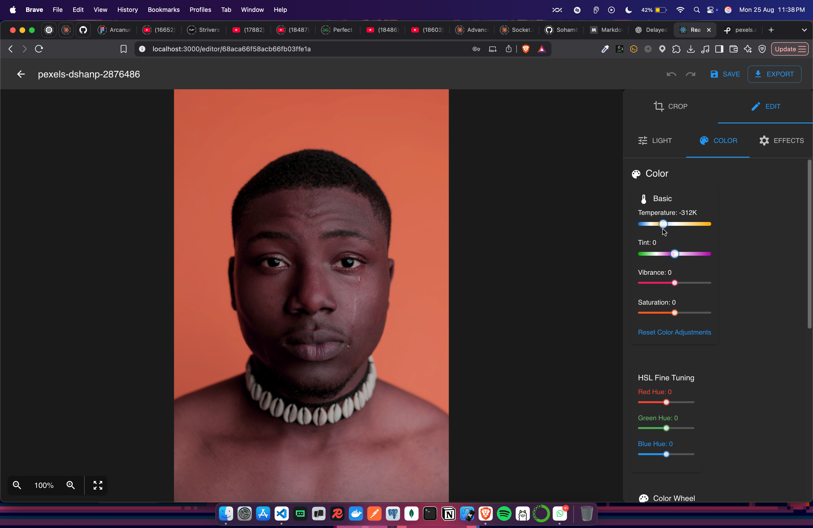
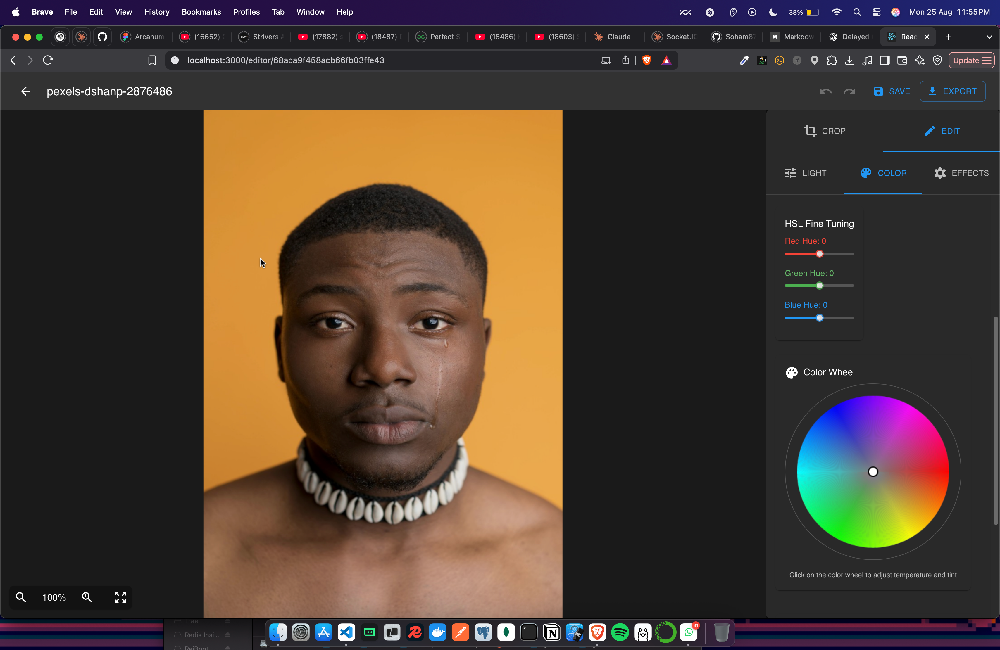
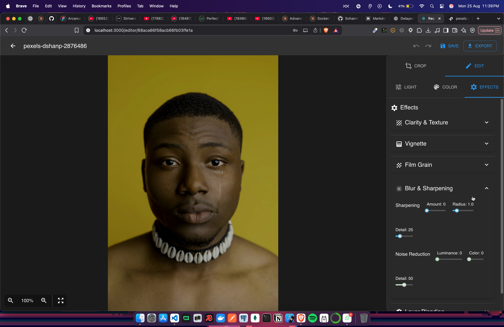

# 🎨 Professional Adobe Lightroom Clone

A comprehensive, professional-grade photo editing application built with the MERN stack, featuring advanced image processing capabilities, real-time editing, and a sleek dark interface inspired by Adobe Lightroom.


## 📸 Photo Import & Selection

Experience seamless photo importing with our intuitive drag-and-drop interface. Select multiple photos from your local device and start editing immediately.

<div align="center">
  
  <p><em>Drag and drop multiple photos or click to browse your local files</em></p>
</div>

<div align="center">
  
  <p><em>Browse and select photos from your computer with preview thumbnails</em></p>
</div>

## ✨ Key Features

### 🎯 **Professional Photo Editing Suite**
- **Interactive Crop Tool** - Precise cropping with aspect ratio constraints
- **Advanced Light Controls** - Professional exposure, contrast, and tone adjustments
- **Color Grading** - Temperature, tint, vibrance, and HSL fine-tuning
- **Effects & Filters** - Clarity, texture, vignette, grain, and professional effects
- **Export System** - Multiple formats with quality control and batch processing

### 🔧 **Technical Excellence**
- **Full MERN Stack** - MongoDB, Express.js, React, Node.js with TypeScript
- **Real-time Processing** - Canvas-based rendering with immediate preview
- **Professional UI/UX** - Dark theme inspired by Adobe Lightroom
- **Error Handling** - Comprehensive error boundaries and validation
- **Performance Optimized** - Image caching, debouncing, and memory management

## 🎨 Feature Showcase Gallery

Explore the comprehensive editing capabilities of our Lightroom clone through this feature gallery:

<div align="center">

  ### Main Editor Interface
  
  <p><em>Professional dark interface with intuitive controls</em></p>

  ### Crop & Transform Tools
  
  <p><em>Precise cropping with aspect ratios, rotation, and flip controls</em></p>

  ### Light Adjustments
  
  
  <p><em>Professional light controls with interactive curves and live histogram</em></p>

  ### Color Grading Suite
  
  
  <p><em>Advanced color tools with temperature, tint, and HSL adjustments</em></p>

  ### Creative Effects
  
  <p><em>Professional effects including vignette, grain, clarity, and texture</em></p>

</div>

---

## 🏗️ Architecture & Tech Stack

### **Frontend (React + TypeScript)**
```typescript
├── React 18.2.0          - Modern UI library with hooks
├── TypeScript 5.0.0      - Type-safe development
├── Material-UI 5.14.0    - Professional component library
├── Fabric.js 5.3.0       - Interactive crop tool
├── D3.js 7.8.0           - Data visualization for histograms/curves
├── React-Color 2.19.3    - Advanced color picker
├── RC-Slider 10.2.1      - Custom range sliders
├── React-Dropzone 14.2.3 - Drag-and-drop file uploads
└── Konva.js 9.2.0        - 2D canvas library for image manipulation
```

### **Backend (Node.js + Express)**
```javascript
├── Node.js 18.0.0        - Runtime environment
├── Express.js 4.18.2     - Web framework
├── MongoDB 6.0.0         - Document database
├── Mongoose 7.5.0        - MongoDB object modeling
├── Sharp 0.32.5          - High-performance image processing
├── Multer 1.4.5          - File upload handling
├── JSON Web Token 9.0.2  - Authentication
└── Bcrypt.js 2.4.3       - Password hashing
```

### **Image Processing & Optimization**
```javascript
├── Sharp.js              - Server-side image processing
├── Canvas API            - Client-side rendering
├── WebGL Context         - Hardware-accelerated processing
├── Image Caching         - Memory-efficient image management
└── Web Workers           - Background processing (planned)
```

---

## 🎨 Feature Showcase

### **1. 📸 Professional Image Import**

#### **Drag & Drop Upload**
- Multi-file drag-and-drop interface
- Real-time upload progress indicators
- Automatic thumbnail and preview generation
- EXIF metadata extraction and display
- Support for JPEG, PNG, TIFF, and WebP formats

```javascript
// Supported formats and processing
const supportedFormats = ['image/jpeg', 'image/png', 'image/tiff', 'image/webp'];
const maxFileSize = 50 * 1024 * 1024; // 50MB limit
```

#### **Smart Storage Management**
- User storage quotas and monitoring
- Automatic thumbnail generation (300x300px)
- High-quality previews (1200x1200px)
- Original file preservation

### **2. ✂️ Interactive Crop Tool**

#### **Precision Cropping**
- Visual crop handles with real-time preview
- Aspect ratio constraints (1:1, 4:3, 16:9, custom)
- Rotation controls (-90°, +90°, custom angles)
- Flip operations (horizontal, vertical)

```typescript
interface CropSettings {
  x: number;           // Crop position X
  y: number;           // Crop position Y
  width: number;       // Crop width
  height: number;      // Crop height
  rotation: number;    // Rotation angle
  flipX: boolean;      // Horizontal flip
  flipY: boolean;      // Vertical flip
}
```

#### **Advanced Crop Features**
- Grid overlay for rule of thirds
- Magnetic alignment guides
- Keyboard shortcuts for precision adjustment
- Non-destructive editing with history

### **3. 🌅 Professional Light Controls**

#### **Basic Adjustments**
- **Exposure** (-5.00 to +5.00 EV) - Overall brightness control
- **Contrast** (-100 to +100) - Contrast enhancement
- **Highlights** (-100 to +100) - Highlight recovery
- **Shadows** (-100 to +100) - Shadow detail enhancement
- **Whites** (-100 to +100) - White point adjustment
- **Blacks** (-100 to +100) - Black point control

```typescript
interface LightAdjustments {
  exposure: number;     // -5.00 to +5.00
  contrast: number;     // -100 to +100
  highlights: number;   // -100 to +100
  shadows: number;      // -100 to +100
  whites: number;       // -100 to +100
  blacks: number;       // -100 to +100
}
```

#### **Interactive Tone Curves**
- Drag-and-drop curve control points
- Real-time curve preview with D3.js
- RGB and luminance curve editing
- Professional curve presets

#### **Live Histogram**
- Multi-channel RGB histogram
- Luminance histogram overlay
- Real-time updates during editing
- Clipping indicators

### **4. 🎨 Advanced Color Controls**

#### **Color Temperature & Tint**
- **Temperature** (-1000K to +1000K) - Warm/cool adjustment
- **Tint** (-100 to +100) - Green/magenta balance
- Visual color wheel interface
- White balance presets (Daylight, Tungsten, Fluorescent)

#### **Color Enhancement**
- **Vibrance** (-100 to +100) - Intelligent saturation
- **Saturation** (-100 to +100) - Overall color intensity
- Smart color protection algorithms
- Skin tone preservation

#### **HSL Fine-Tuning**
```typescript
interface HSLAdjustments {
  red: { hue: number; saturation: number; lightness: number };
  green: { hue: number; saturation: number; lightness: number };
  blue: { hue: number; saturation: number; lightness: number };
}
```

#### **Professional Color Tools**
- Interactive color wheel (360° hue selection)
- Advanced color picker with swatches
- Color preset library
- Color harmony suggestions

### **5. ✨ Creative Effects Suite**

#### **Texture & Clarity**
- **Texture** (-100 to +100) - Surface detail enhancement
- **Clarity** (-100 to +100) - Mid-tone contrast
- **Dehaze** (-100 to +100) - Atmospheric haze control
- **Structure** (-100 to +100) - Edge definition

#### **Professional Vignette**
```typescript
interface VignetteSettings {
  enabled: boolean;
  amount: number;       // -100 to +100
  midpoint: number;     // 0 to 100
  roundness: number;    // -100 to +100
  feather: number;      // 0 to 100
  style: 'round' | 'square' | 'custom';
}
```

#### **Film Grain Simulation**
- **Amount** (0 to 100) - Grain intensity
- **Size** (0 to 100) - Grain particle size
- **Roughness** (0 to 100) - Grain texture variation
- Authentic film grain patterns

#### **Sharpening & Noise Reduction**
- **Sharpening**: Amount, Radius, Detail control
- **Noise Reduction**: Luminance and Color noise
- **Detail Preservation**: Smart edge detection
- **Masking**: Selective sharpening areas

### **6. 🎯 Layer Blending System**

#### **Blend Modes**
- Normal, Multiply, Screen, Overlay
- Soft Light, Hard Light, Color Dodge
- Color Burn, Darken, Lighten
- Difference, Exclusion modes

#### **Opacity Control**
- Global opacity adjustment (0-100%)
- Layer-specific opacity settings
- Real-time blend preview

### **7. 📤 Professional Export System**

#### **Multiple Export Formats**
```typescript
const exportFormats = [
  { format: 'JPEG', quality: '1-100', colorSpace: 'sRGB/AdobeRGB' },
  { format: 'PNG', quality: 'Lossless', transparency: 'Supported' },
  { format: 'TIFF', quality: 'Lossless', bitDepth: '8/16-bit' },
  { format: 'WebP', quality: '1-100', fileSize: 'Optimized' }
];
```

#### **Export Features**
- Custom dimensions with aspect ratio lock
- Color space conversion (sRGB, Adobe RGB, ProPhoto RGB)
- Metadata inclusion/exclusion options
- Batch export with progress tracking
- ZIP archive generation for bulk exports

#### **Watermark System**
- Text watermark with custom positioning
- Opacity and font size controls
- Multiple position presets
- Batch watermark application

## 🚀 Getting Started

### **Prerequisites**
```bash
Node.js >= 18.0.0
MongoDB >= 6.0.0
npm >= 8.0.0
```

### **Installation**

1. **Clone the repository**
```bash
git clone https://github.com/your-username/lightroom-clone.git
cd lightroom-clone
```

2. **Install dependencies**
```bash
# Install root dependencies
npm install

# Install client dependencies
cd client && npm install

# Install server dependencies
cd ../server && npm install
```

3. **Environment Setup**
```bash
# Create server/.env file
MONGODB_URI=mongodb://localhost:27017/lightroom-clone
JWT_SECRET=your-super-secret-jwt-key
NODE_ENV=development
PORT=5000

# Create client/.env file
REACT_APP_API_URL=http://localhost:5000/api
REACT_APP_ENV=development
```

4. **Start the application**
```bash
# Start MongoDB service
mongod

# Start the backend server (from root directory)
npm run server

# Start the frontend client (from root directory)
npm run client

# Or run both concurrently
npm run dev
```

5. **Access the application**
- Frontend: `http://localhost:3000`
- Backend API: `http://localhost:5000`
- MongoDB: `mongodb://localhost:27017`

---

## 📚 API Documentation

### **Authentication Endpoints**
```http
POST /api/auth/register    # User registration
POST /api/auth/login       # User login
GET  /api/auth/refresh     # Token refresh
POST /api/auth/logout      # User logout
```

### **Project Management**
```http
GET    /api/projects           # Get user projects
GET    /api/projects/:id       # Get specific project
PUT    /api/projects/:id       # Update project
DELETE /api/projects/:id       # Delete project
POST   /api/projects/:id/crop  # Apply crop settings
```

### **File Upload**
```http
POST /api/upload           # Single file upload
POST /api/upload/batch     # Multiple file upload
GET  /api/upload/storage   # Storage statistics
```

### **Export System**
```http
POST /api/export/:id       # Export single project
POST /api/export/batch     # Batch export projects
```

---

## 🎮 Keyboard Shortcuts

### **Global Shortcuts**
| Shortcut | Action |
|----------|--------|
| `Ctrl + S` | Save project |
| `Ctrl + Z` | Undo last action |
| `Ctrl + Y` | Redo last action |
| `Ctrl + E` | Export image |
| `Ctrl + U` | Upload images |

### **Editor Shortcuts**
| Shortcut | Action |
|----------|--------|
| `Ctrl + =` | Zoom in |
| `Ctrl + -` | Zoom out |
| `Ctrl + 0` | Fit to screen |
| `R` | Switch to crop tool |
| `1` | Switch to light adjustments |
| `2` | Switch to color adjustments |
| `3` | Switch to effects |
| `F` | Toggle fullscreen |

### **Crop Tool Shortcuts**
| Shortcut | Action |
|----------|--------|
| `Enter` | Apply crop |
| `Escape` | Cancel crop |
| `Shift + Drag` | Constrain aspect ratio |
| `Alt + Drag` | Crop from center |

---

## 🏗️ Project Structure

```
lightroom-clone/
├── 📁 client/                    # React TypeScript frontend
│   ├── 📁 public/               # Static assets
│   ├── 📁 src/
│   │   ├── 📁 components/       # Reusable UI components
│   │   │   ├── CropTool.tsx     # Interactive crop functionality
│   │   │   ├── LightControls.tsx # Light adjustment controls
│   │   │   ├── ColorControls.tsx # Color grading tools
│   │   │   ├── EffectsControls.tsx # Effects and filters
│   │   │   ├── ExportPanel.tsx  # Export system
│   │   │   ├── ErrorBoundary.tsx # Error handling
│   │   │   └── ...
│   │   ├── 📁 pages/            # Main application pages
│   │   │   ├── LoginPage.tsx    # User authentication
│   │   │   ├── RegisterPage.tsx # User registration
│   │   │   ├── DashboardPage.tsx # Project gallery
│   │   │   └── EditorPage.tsx   # Main editing interface
│   │   ├── 📁 hooks/            # Custom React hooks
│   │   │   ├── useKeyboardShortcuts.ts # Keyboard shortcuts
│   │   │   └── ...
│   │   ├── 📁 utils/            # Utility functions
│   │   │   ├── api.ts           # API client
│   │   │   ├── performance.ts   # Performance optimizations
│   │   │   └── ...
│   │   ├── 📁 context/          # React context providers
│   │   │   └── AuthContext.tsx  # Authentication state
│   │   ├── 📁 types/            # TypeScript definitions
│   │   │   └── index.ts         # Type definitions
│   │   └── 📁 styles/           # Styling and themes
│   │       └── theme.ts         # Material-UI theme
│   └── 📄 package.json          # Frontend dependencies
├── 📁 server/                   # Node.js Express backend
│   ├── 📁 models/               # MongoDB data models
│   │   ├── User.js              # User schema
│   │   └── Project.js           # Project schema
│   ├── 📁 routes/               # API route handlers
│   │   ├── auth.js              # Authentication routes
│   │   ├── projects.js          # Project management
│   │   ├── upload.js            # File upload handling
│   │   └── export.js            # Export functionality
│   ├── 📁 middleware/           # Express middleware
│   │   └── auth.js              # JWT authentication
│   ├── 📁 config/               # Configuration files
│   │   └── database.js          # MongoDB connection
│   ├── 📄 server.js             # Main server entry point
│   └── 📄 package.json          # Backend dependencies
├── 📁 uploads/                  # File storage directory
│   ├── 📁 thumbnails/           # Generated thumbnails
│   ├── 📁 previews/             # Preview images
│   └── 📁 exports/              # Exported files
├── 📁 assets/                   # Images and screenshots for README
│   ├── photo-import.png         # Photo import interface
│   ├── file-selection.png       # Local file selection
│   ├── main-editor.png          # Main editor interface
│   ├── crop-tool.png            # Crop tool screenshot
│   ├── rotation-flip.png        # Rotation and flip controls
│   ├── light-controls.png       # Light adjustment controls
│   ├── curves-histogram.png     # Curves and histogram
│   ├── color-picker.png         # Color grading tools
│   ├── hsl-controls.png         # HSL fine-tuning
│   ├── effects-panel.png        # Effects and filters
│   ├── vignette-grain.png       # Vignette and grain effects
│   ├── before-after.png         # Before/after comparison
│   ├── export-panel.png         # Export settings
│   ├── export-formats.png       # Export format options
│   ├── batch-export.png         # Batch export process
│   └── export-complete.png      # Export completion
├── 📄 package.json              # Root package configuration
├── 📄 README.md                 # Project documentation
└── 📄 .gitignore                # Git ignore rules
```

---

## 🔧 Performance Optimizations

### **Frontend Optimizations**
- **Image Caching**: LRU cache for processed images
- **Debounced Updates**: Prevents excessive re-renders during slider adjustments
- **Canvas Optimization**: Hardware-accelerated rendering
- **Memory Management**: Automatic cleanup of unused resources
- **Code Splitting**: Lazy loading of heavy components

### **Backend Optimizations**
- **Image Processing Pipeline**: Efficient Sharp.js operations
- **Thumbnail Generation**: Automatic preview creation
- **Database Indexing**: Optimized MongoDB queries
- **File Stream Handling**: Memory-efficient file operations
- **Compression**: Response compression for faster transfers

### **Memory Management**
```typescript
// Image cache with LRU eviction
export class ImageCache {
  private cache = new Map<string, HTMLImageElement>();
  private maxSize = 50; // Maximum cached images

  // Automatic cleanup of least recently used images
  private evictLRU(): void {
    // Implementation details...
  }
}
```

---

## 🧪 Testing & Quality Assurance

### **Testing Stack**
```json
{
  "frontend": ["Jest", "React Testing Library", "Cypress"],
  "backend": ["Jest", "Supertest", "MongoDB Memory Server"],
  "e2e": ["Cypress", "Playwright"],
  "quality": ["ESLint", "Prettier", "TypeScript"]
}
```

### **Code Quality**
- **TypeScript**: Full type safety across the application
- **ESLint**: Code linting with custom rules
- **Prettier**: Consistent code formatting
- **Error Boundaries**: Graceful error handling
- **Performance Monitoring**: Built-in performance tracking

---

## 🔒 Security Features

### **Authentication & Authorization**
- JWT token-based authentication
- Password hashing with bcrypt
- Protected API routes
- Session management
- Rate limiting (planned)

### **File Security**
- File type validation
- File size limits (50MB max)
- Secure file storage
- Path traversal protection
- CORS configuration

### **Data Protection**
- Input sanitization
- SQL injection prevention
- XSS protection
- Secure HTTP headers
- Environment variable protection

---

## 🚧 Future Enhancements

### **Planned Features**
- [ ] **AI-Powered Auto-Adjustments** - Automatic photo enhancement
- [ ] **Batch Processing** - Apply adjustments to multiple images
- [ ] **Cloud Storage Integration** - AWS S3, Google Drive support
- [ ] **Collaborative Editing** - Real-time collaboration features
- [ ] **Mobile App** - React Native companion app
- [ ] **Plugin System** - Third-party plugin support
- [ ] **Advanced Filters** - Custom filter creation
- [ ] **RAW File Support** - Professional RAW image processing
- [ ] **Video Editing** - Basic video editing capabilities
- [ ] **Social Sharing** - Direct social media integration

### **Technical Improvements**
- [ ] **Web Workers** - Background image processing
- [ ] **Progressive Web App** - Offline functionality
- [ ] **GraphQL API** - More efficient data fetching
- [ ] **Microservices** - Scalable architecture
- [ ] **Docker Containers** - Containerized deployment
- [ ] **CDN Integration** - Global content delivery
- [ ] **Advanced Caching** - Redis integration
- [ ] **Real-time Sync** - WebSocket-based synchronization

---

## 🤝 Contributing

We welcome contributions! Please follow these steps:

1. **Fork the repository**
2. **Create a feature branch** (`git checkout -b feature/AmazingFeature`)
3. **Commit your changes** (`git commit -m 'Add some AmazingFeature'`)
4. **Push to the branch** (`git push origin feature/AmazingFeature`)
5. **Open a Pull Request**

### **Development Guidelines**
- Follow TypeScript best practices
- Write comprehensive tests
- Update documentation
- Follow the existing code style
- Add appropriate error handling

---

## 📝 License

This project is licensed under the MIT License - see the [LICENSE](LICENSE) file for details.

---

## 🙏 Acknowledgments

- **Adobe Lightroom** - Inspiration for the user interface and functionality
- **React Community** - Amazing ecosystem and libraries
- **Material-UI** - Beautiful and accessible components
- **Sharp.js** - Excellent image processing library
- **D3.js** - Powerful data visualization tools
- **Fabric.js** - Interactive canvas functionality
- **MongoDB** - Flexible and scalable database solution

---

## 📞 Support & Contact

- **GitHub Issues**: [Report bugs and request features](https://github.com/Soham8763/lightroom-clone/issues)
- **Email**: soham7857@example.com
- **Discord**: Join our development community

---

## 📊 Project Stats


---

<div align="center">
  <h3>🎨 Built with ❤️ for photographers and developers</h3>
  <p>Transform your photos with professional-grade editing tools</p>

  **⭐ Star this repository if you find it helpful!**
</div>

---
